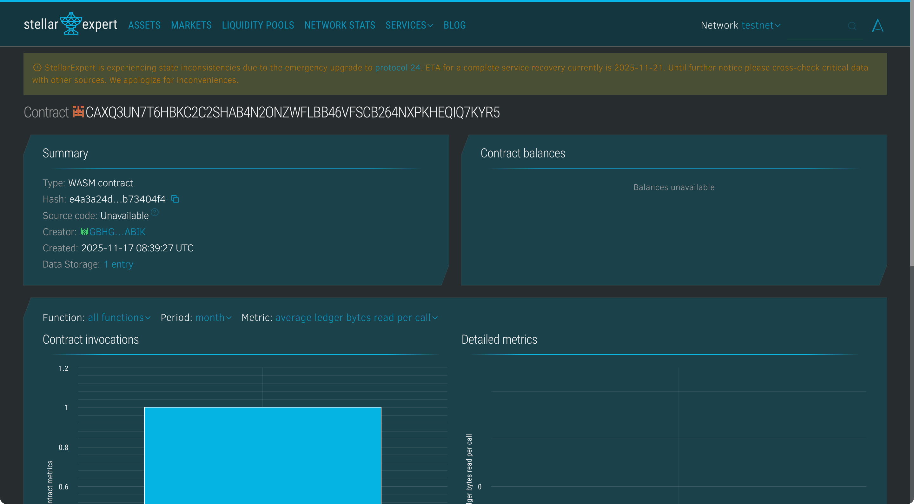

# GreenScore Ledger

## Project Title

**GreenScore Ledger** - Blockchain-Based Carbon Footprint Tracking System

## Project Description

GreenScore Ledger is a decentralized blockchain platform built on the Stellar network using Soroban smart contracts that enables transparent tracking and verification of carbon footprint data for companies and products. The platform creates an immutable, verifiable record of carbon emissions, empowering consumers, regulators, and stakeholders to make informed decisions based on accurate environmental impact data.

By leveraging blockchain technology, GreenScore Ledger ensures data integrity, prevents greenwashing, and promotes corporate accountability in the fight against climate change.

## Project Vision

Our vision is to create a transparent and trustworthy ecosystem for environmental accountability by:

- **Combating Greenwashing**: Providing verifiable, immutable carbon footprint data that cannot be manipulated or falsified
- **Empowering Consumers**: Enabling informed purchasing decisions based on accurate environmental impact information
- **Driving Corporate Responsibility**: Incentivizing companies to reduce emissions through transparent public tracking
- **Supporting Regulation**: Providing regulators and policymakers with reliable data for environmental compliance
- **Accelerating Climate Action**: Creating a global standard for carbon footprint measurement and reporting
- **Building Trust**: Establishing a decentralized, auditable system that all stakeholders can trust
- **Promoting Sustainability**: Encouraging sustainable business practices through transparency and accountability

## Key Features

### 1. **Carbon Footprint Registration**

- Companies and products can register their carbon emission data on-chain
- Emissions measured in kilograms of CO2 equivalent
- Automatic timestamping of all submissions
- Unique entity ID for easy tracking and reference
- Supports both company-wide and product-specific footprints

### 2. **Entity Classification**

- Distinguish between "Company" and "Product" carbon records
- Separate tracking for organizational vs. product-level emissions
- Enables granular analysis of environmental impact
- Supports supply chain transparency initiatives

### 3. **Verification System**

- Independent verifiers can authenticate carbon footprint data
- Verification status clearly marked on each record
- Prevents unverified claims from being treated as factual
- Builds trust through third-party validation
- Immutable verification records prevent tampering

### 4. **Data Update Capability**

- Entities can update their carbon emission data as measurements improve
- Updates automatically reset verification status
- Maintains complete audit trail with timestamps
- Encourages continuous improvement in measurement accuracy
- Reflects real-time changes in environmental impact

### 5. **Comprehensive Analytics**

- Platform-wide statistics on total emissions tracked
- Count of verified vs. unverified records
- Separate tracking for companies and products
- Total records registered on the platform
- Real-time transparency into global carbon footprint data

### 6. **Immutable Record Keeping**

- All data stored permanently on the Stellar blockchain
- Complete audit trail of all submissions and updates
- Prevents historical data manipulation
- Enables long-term trend analysis
- Supports regulatory compliance and reporting

### 7. **Authenticated Submissions**

- Address-based authentication ensures data integrity
- Only authorized parties can submit or update records
- Verifier authentication prevents fraudulent validations
- Built-in access control for sensitive operations

## Contract Details
- Contract Address: CAXQ3UN7T6HBKC2C2SHAB4N2ONZWFLBB46VFSCB264NXPKHEQIQ7KYR5


## Future Scope

### Short-term Enhancements

1. **Scope Classification**: Differentiate between Scope 1, 2, and 3 emissions per GHG Protocol standards
2. **Industry Benchmarking**: Compare emissions against industry averages and standards
3. **Certification Integration**: Link to recognized carbon certification bodies (ISO 14064, PAS 2060)
4. **Emission Reduction Tracking**: Track progress toward carbon reduction goals over time
5. **Multi-Year Data**: Support historical data spanning multiple years for trend analysis

### Medium-term Development

6. **Carbon Credit Integration**: Connect verified emissions with carbon offset/credit markets
7. **Supply Chain Tracking**: Enable end-to-end product carbon footprint across supply chains
8. **API for Third-Party Access**: Allow integration with ESG reporting platforms and tools
9. **Automated Verification**: Integrate IoT sensors and AI for real-time emission monitoring
10. **Rating System**: Develop standardized green score ratings (A+ to F) based on emissions data
11. **Public Dashboard**: User-friendly interface for browsing and comparing carbon footprints
12. **NFT Certificates**: Issue NFT-based green certificates for verified low-emission products
13. **Whistleblower Mechanism**: Allow reporting of suspected fraudulent carbon claims

### Long-term Vision

14. **Global Carbon Registry**: Become the universal standard for carbon footprint recording
15. **Regulatory Integration**: Direct integration with government environmental agencies
16. **Carbon Tax Automation**: Automatic calculation and payment of carbon taxes based on recorded data
17. **AI-Powered Predictions**: Machine learning models to predict future emissions trends
18. **Consumer Mobile App**: Scan product barcodes to instantly view carbon footprints
19. **Blockchain Interoperability**: Cross-chain carbon data sharing and verification
20. **Satellite Data Integration**: Verify emissions using satellite monitoring and remote sensing
21. **Carbon Marketplace**: Built-in marketplace for trading verified carbon reduction credits
22. **Incentive Programs**: Reward low-emission companies with tokenized incentives
23. **Academic Research Portal**: Provide anonymized data for climate research institutions
24. **Corporate Sustainability Dashboard**: Comprehensive tools for ESG reporting and compliance
25. **International Standards Compliance**: Full alignment with TCFD, CDP, and other frameworks

---

## Smart Contract Functions

### `register_carbon_record(submitter, entity_name, entity_type, carbon_emission)`

Registers a new carbon footprint record for a company or product.

**Parameters:**

- `submitter`: Address of the entity submitting the data
- `entity_name`: Name of the company or product
- `entity_type`: Either "Company" or "Product"
- `carbon_emission`: Carbon emission in kg CO2 equivalent

**Returns:** Unique entity ID

**Example:**

```rust
register_carbon_record(
    submitter_address,
    "EcoTech Manufacturing",
    "Company",
    250000  // 250,000 kg CO2
)
```

### `verify_carbon_record(verifier, entity_id)`

Verifies the accuracy of a carbon footprint record.

**Parameters:**

- `verifier`: Address of the authorized verifier
- `entity_id`: Unique identifier of the record to verify

**Access Control:** Only authorized verifiers can call this function

**Example:**

```rust
verify_carbon_record(verifier_address, 1)
```

### `update_carbon_emission(updater, entity_id, new_emission)`

Updates the carbon emission data for an existing record.

**Parameters:**

- `updater`: Address of the entity updating the data
- `entity_id`: Unique identifier of the record to update
- `new_emission`: New carbon emission value in kg CO2

**Note:** Updates reset verification status, requiring re-verification

**Example:**

```rust
update_carbon_emission(updater_address, 1, 230000)  // Reduced to 230,000 kg CO2
```

### `get_carbon_record(entity_id)`

Retrieves detailed carbon footprint information for a specific entity.

**Parameters:**

- `entity_id`: Unique identifier of the record

**Returns:** CarbonRecord structure containing:

- Entity ID and name
- Entity type (Company/Product)
- Carbon emission value
- Verification status
- Timestamp of last update

**Example:**

```rust
let record = get_carbon_record(1);
```

### `get_platform_stats()`

Returns comprehensive platform-wide statistics.

**Returns:** PlatformStats structure containing:

- Total records registered
- Number of verified records
- Total emissions tracked (kg CO2)
- Company count
- Product count

**Example:**

```rust
let stats = get_platform_stats();
```

---

## Technology Stack

- **Blockchain**: Stellar Network
- **Smart Contract**: Soroban SDK (Rust)
- **Storage**: On-chain persistent storage with TTL management
- **Authentication**: Address-based authentication with `require_auth()`
- **Data Integrity**: Immutable blockchain records

---

## Getting Started

### Prerequisites

- Rust toolchain (version 1.70+)
- Soroban CLI
- Stellar account (testnet or mainnet)
- Basic understanding of carbon accounting principles

### Installation

```bash
# Install Rust
curl --proto '=https' --tlsv1.2 -sSf https://sh.rustup.rs | sh

# Install Soroban CLI
cargo install --locked soroban-cli

# Add WebAssembly target
rustup target add wasm32-unknown-unknown
```

### Building the Contract

```bash
# Clone the repository
git clone <repository-url>
cd greenscore-ledger

# Build the contract
soroban contract build

# The compiled WASM will be in:
# target/wasm32-unknown-unknown/release/greenscore_ledger.wasm
```

### Deployment

```bash
# Deploy to Stellar testnet
soroban contract deploy \
  --wasm target/wasm32-unknown-unknown/release/greenscore_ledger.wasm \
  --network testnet \
  --source <YOUR_SECRET_KEY>

# Save the contract ID returned
export CONTRACT_ID=<returned_contract_id>
```

### Example Usage

```bash
# Register a company's carbon footprint
soroban contract invoke \
  --id $CONTRACT_ID \
  --network testnet \
  -- register_carbon_record \
  --submitter <COMPANY_ADDRESS> \
  --entity_name "GreenCorp Industries" \
  --entity_type "Company" \
  --carbon_emission 1500000

# Verify the record
soroban contract invoke \
  --id $CONTRACT_ID \
  --network testnet \
  -- verify_carbon_record \
  --verifier <VERIFIER_ADDRESS> \
  --entity_id 1

# View platform statistics
soroban contract invoke \
  --id $CONTRACT_ID \
  --network testnet \
  -- get_platform_stats
```

---

## Use Cases

### 1. **Corporate ESG Reporting**

Companies can maintain transparent, auditable carbon footprint records for stakeholder reporting.

### 2. **Product Carbon Labels**

Manufacturers can provide verified carbon footprint data for eco-conscious consumers.

### 3. **Supply Chain Transparency**

Track carbon emissions across entire product supply chains from raw materials to delivery.

### 4. **Regulatory Compliance**

Meet environmental disclosure requirements with immutable, verifiable data.

### 5. **Carbon Trading Markets**

Verified emission data can support carbon credit trading and offset programs.

### 6. **Investment Decisions**

Investors can assess companies based on verified environmental performance data.

### 7. **Consumer Choice**

Shoppers can compare products based on carbon footprints to make sustainable purchases.

### 8. **Academic Research**

Researchers can access anonymized carbon data for climate studies and policy analysis.

---

## Impact & Benefits

🌍 **Environmental Impact**: Drives corporate accountability for climate action  
✅ **Data Integrity**: Blockchain ensures carbon claims cannot be falsified  
🔍 **Transparency**: Public visibility into environmental performance  
📊 **Standardization**: Creates consistent carbon reporting framework  
🛡️ **Anti-Greenwashing**: Verification prevents false environmental claims  
💼 **Business Value**: Demonstrates commitment to sustainability  
🌱 **Consumer Empowerment**: Enables informed sustainable purchasing decisions  
📈 **Progress Tracking**: Monitor emission reduction efforts over time

---

## Contributing to Climate Action

GreenScore Ledger is more than a tracking system—it's a movement toward environmental transparency and accountability. By providing immutable, verifiable carbon footprint data, we empower all stakeholders to participate in the fight against climate change.

**Join us in building a sustainable future, one verified emission record at a time.**

---

## License

This project is licensed under the MIT License.

## Contact

For questions, partnerships, or support:

- Website: [greenscore-ledger.io]
- Email: contact@greenscore-ledger.io
- Twitter: @GreenScoreLedger

---

**GreenScore Ledger** - Making carbon accountability transparent, verifiable, and actionable.
